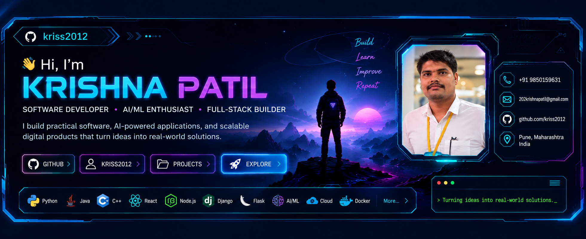

<div align="center">

<!-- ===================== PROFILE HERO ===================== -->

<a href="https://github.com/kriss2012">
  
</a>

<br/>

# 👋 Hi, I'm Krishna Patil

### 🚀 Software Developer • AI/ML Enthusiast • Full-Stack Builder

<p>
I build practical software, AI-powered applications, and scalable digital products
that turn ideas into real-world solutions.
</p>

<p>
<a href="https://github.com/kriss2012">

</a>

<a href="https://github.com/kriss2012?tab=repositories">

</a>

<a href="mailto:202krishnapatil@gmail.com">

</a>

</p>

</div>

---

# 🧑‍💻 About Me

I'm **Krishna Patil**, a software developer and computer science graduate passionate about building technology that solves practical problems.

My interests span:

**Artificial Intelligence • Machine Learning • Full-Stack Development • Backend Engineering • Cloud Technologies • Computer Vision • NLP • Developer Tools**

I enjoy taking an idea from:

```text
💡 Idea
   ↓
🧠 Architecture
   ↓
💻 Development
   ↓
🤖 AI / Automation
   ↓
🧪 Testing
   ↓
🚀 Deployment
   ↓
🌍 Real-World Impact
```

### 🔭 What I Do

- 🤖 Build AI/ML-powered applications
- 🌐 Develop modern full-stack web applications
- ⚙️ Design REST APIs and backend systems
- 🧠 Experiment with NLP, Computer Vision and Generative AI
- ☁️ Explore cloud and deployment technologies
- 🏆 Participate in hackathons and innovation challenges
- 🔬 Work on research-oriented technology projects
- 🚀 Turn prototypes into usable products
- 🌱 Continuously learn new technologies

---

# ⚡ Current Focus

<table width="100%">
<tr>

<td width="50%" valign="top">

## 🤖 Artificial Intelligence

- Machine Learning
- NLP
- Computer Vision
- Generative AI
- AI Agents
- Recommendation Systems
- AI-powered automation

</td>

<td width="50%" valign="top">

## 💻 Software Engineering

- Backend Development
- Full-Stack Applications
- REST APIs
- Database Architecture
- Cloud Deployment
- DevOps
- Scalable Systems

</td>

</tr>
</table>

---

# 🛠️ Tech Stack

<div align="center">

## 💻 Programming Languages


<br/><br/>

## 🌐 Frontend


<br/><br/>

## ⚙️ Backend


<br/><br/>

## 🗄️ Databases


<br/><br/>

## ☁️ Cloud & DevOps


<br/><br/>

## 🤖 AI / ML


</div>

---

# 🧠 AI & Machine Learning

I enjoy combining software engineering with AI to build applications that are useful beyond simple demonstrations.

### Areas I Work With

| Area | Technologies |
|---|---|
| Machine Learning | Scikit-learn, TensorFlow, PyTorch |
| NLP | TF-IDF, NLP pipelines, spaCy |
| Computer Vision | OpenCV, image processing |
| Generative AI | LLM APIs, AI assistants, prompt engineering |
| Recommendation Systems | Similarity models, ranking, ML pipelines |
| AI Applications | Flask, Django, REST APIs |
| Data | Python, Pandas, NumPy |

---

# 📊 GitHub Statistics

<div align="center">

<a href="https://github.com/kriss2012">

</a>

<a href="https://github.com/kriss2012?tab=repositories">

</a>

<a href="https://github.com/kriss2012?tab=repositories">

</a>

</div>

### 📌 Profile Overview

```text
╔══════════════════════════════════════════════╗
║             KRISHNA PATIL                    ║
╠══════════════════════════════════════════════╣
║ GitHub       : github.com/kriss2012          ║
║ Focus        : AI + Software Engineering     ║
║ Development  : Full-Stack + Backend          ║
║ Interests    : AI / ML / CV / NLP            ║
║ Goal         : Build Real-World Solutions    ║
╚══════════════════════════════════════════════╝
```

> GitHub's own contribution calendar is available directly on my profile and is intentionally not duplicated with third-party graph services here.

---

# 🏆 Hackathons & Innovation

<table width="100%">

<tr>

<td width="50%" align="center" valign="top">

## 🥇 Smart India Hackathon

Worked on an AI-powered urban traffic intelligence solution focused on:

**Multi-camera ANPR trajectory tracking and urban traffic analytics**

</td>

<td width="50%" align="center" valign="top">

## 🧠 AI & Innovation Challenges

Participated in technology-focused hackathons and innovation programs involving:

**Artificial Intelligence • Software Engineering • Automation • Real-World Problem Solving**

</td>

</tr>

<tr>

<td width="50%" align="center" valign="top">

## 🚦 TraffiX-AI

AI-driven traffic intelligence platform combining:

- Computer Vision
- ANPR
- Trajectory Analysis
- Urban Analytics

</td>

<td width="50%" align="center" valign="top">

## 🌡️ ThermoHeal-AI

Research-oriented smart wellness technology combining:

- Biomaterials
- Sensors
- Bluetooth
- AI Analytics

</td>

</tr>

</table>

---

# 🚀 Featured Projects

## 🚦 TraffiX-AI

### AI Engine for Multi-Camera ANPR Trajectory Tracking & Urban Traffic Analytics

A computer-vision-driven platform designed to process multi-camera traffic data and extract meaningful vehicle movement and urban traffic intelligence.

### Core Areas

- 🎥 Multi-camera processing
- 🚘 Automatic Number Plate Recognition
- 🧭 Vehicle trajectory tracking
- 📊 Traffic analytics
- 🤖 Computer Vision
- ⚡ Edge AI
- 🗺️ Urban mobility intelligence

🔗 **Repository:**  
https://github.com/kriss2012/TraffiX-AI

---

## 🏠 Findy

### Zero-Brokerage PG & Room Discovery Platform

A platform concept focused on helping students and other users discover rental rooms, PGs and accommodation without unnecessary brokerage layers.

### Focus

- 🏠 Rental discovery
- 📍 Location-based listings
- 👨‍🎓 Student-friendly accommodation
- 🔎 Search and filtering
- 📱 Mobile-first experience
- 🚀 Scalable marketplace architecture

---

## 🤖 Job Recommendation System

### AI-powered Resume & Job Recommendation Platform

A machine-learning project that analyzes resumes and job information to provide relevant recommendations.

### Technology

- Python
- Flask
- Scikit-learn
- TF-IDF
- NLP
- PyPDF2
- MongoDB

### Core Workflow

```text
Resume
  ↓
PDF Extraction
  ↓
Text Processing
  ↓
Feature Extraction
  ↓
TF-IDF
  ↓
Similarity Analysis
  ↓
Job Recommendations
```

---

## 🩺 MediAI Pro

### AI-Assisted Healthcare Application

A healthcare-focused application combining web technologies with AI-based assistance.

### Technology

- Python
- Flask
- AI
- REST APIs
- MongoDB
- Razorpay

> Designed as a wellness/assistance application rather than a replacement for professional medical diagnosis.

---

## 🌡️ ThermoHeal-AI

### Smart Thermoregulatory Insole & AI-Assisted Foot Monitoring

A research-oriented project exploring a smart insole using **banana-waste-derived biomaterials, phase-change materials, sensors, Bluetooth connectivity and AI analytics**.

### Technology Areas

- 🌱 Sustainable biomaterials
- 🌡️ Temperature monitoring
- 📡 Bluetooth
- 🧠 AI analytics
- 👣 Foot monitoring
- ♻️ Banana pseudostem-based materials

---

## 🔧 EchoRepeats

### Technical Gadget Repair Platform

A platform concept designed to simplify technical gadget repair workflows.

### Technology

- Node.js
- Express.js
- MongoDB
- Twilio
- REST APIs
- Mongoose

---

## 🌐 BhashaConverter

### Language Conversion & Translation Application

A project focused on simplifying language conversion through a web-based interface.

### Focus

- 🌍 Multilingual interaction
- 🔤 Text processing
- 🤖 AI-assisted language processing
- 🌐 Web application

---

## ⏰ Reminder App

A productivity application designed around reminders and task management.

### Focus

- 🔔 Reminders
- 📱 Mobile experience
- 🧠 Productivity
- 🎯 Task management

---

# 🧩 Other Projects

Some additional projects and experiments:

- 🛒 E-Commerce Applications
- 🕉️ PujaExpress
- 🎮 Unity Game Development
- 🎯 AI Recommendation Systems
- 🌐 Full-Stack Web Applications
- 📱 Android Applications
- 🧠 AI Assistants
- 🔌 REST API Projects
- 📊 Data & Analytics Projects
- 🎨 Interactive Frontend Experiments

---

# 🏗️ Development Philosophy

I believe good software should be:

```text
Simple
  +
Useful
  +
Scalable
  +
Secure
  +
Maintainable
  +
User-Centric
  =
Better Software 🚀
```

I don't want to build technology just for the sake of technology.

I want to build systems that answer:

> **"What real problem does this solve?"**

---

# 🔬 Research & Innovation

I'm particularly interested in the intersection of:

```text
Artificial Intelligence
        +
Computer Vision
        +
IoT / Sensors
        +
Cloud Computing
        +
Sustainable Technology
        +
Human-Centered Design
```

This combination allows software to move beyond screens and become part of real-world systems.

---

# 📚 Certifications & Learning

### 🎓 Technical Learning

- Full Stack Java Development
- Data Structures & Algorithms
- Java Programming
- Android Development
- Backend Development
- AI / ML
- Cloud Computing
- Modern Web Development

### 🌱 Continuous Learning

Currently exploring:

- Advanced AI
- Generative AI
- Machine Learning
- Cloud Architecture
- System Design
- DevOps
- Scalable Backend Engineering

---

# 🎯 2026 Goals

```text
[████████████████░░░░] Build Better Products

[███████████████░░░░░] Master AI Engineering

[██████████████░░░░░░] Improve System Design

[████████████░░░░░░░░] Contribute to Open Source

[███████████░░░░░░░░░] Build Scalable Products
```

### My Focus

- 🚀 Build production-ready applications
- 🤖 Become stronger in AI engineering
- 🧠 Improve DSA and system design
- ☁️ Develop stronger cloud skills
- 🌍 Contribute to open source
- 🏆 Participate in meaningful hackathons
- 🔬 Continue research and experimentation

---

# 🤝 Open Source & Collaboration

I'm open to collaborating on:

- 🤖 AI/ML projects
- 🌐 Full-stack applications
- ⚙️ Backend systems
- 🧠 Research projects
- 🚀 Startup ideas
- 🏆 Hackathons
- 🌍 Open-source projects
- 💡 Innovative student projects

If you're building something interesting, feel free to connect.

---

# 🌐 Connect With Me

<div align="center">

<a href="https://github.com/kriss2012">

</a>

<a href="mailto:202krishnapatil@gmail.com">

</a>

<a href="tel:+919850159631">

</a>

</div>

---

# 💬 Let's Build Something

<div align="center">

### Have an idea?

### Have a project?

### Want to collaborate?

**Let's turn it into something real. 🚀**

</div>

---

# ⚡ Developer Mode

```bash
$ whoami

Krishna Patil

$ username

kriss2012

$ focus

AI + Software Engineering + Real World Problems

$ build

AI Applications
Full Stack Systems
Backend APIs
Research Projects
Developer Tools

$ philosophy

Build → Test → Learn → Improve → Repeat

$ status

Always Building 🚀
```

---

# 📌 GitHub Profile

<div align="center">

<a href="https://github.com/kriss2012?tab=repositories">

</a>

</div>

---

<div align="center">

### ⭐ If you find something useful here, consider starring the repository.

### 👀 Thanks for visiting my GitHub profile!

<br/>


</div>

---

<div align="center">

> **"Build things that matter. Learn things that last."**

</div>

---

<div align="center">


</div>
